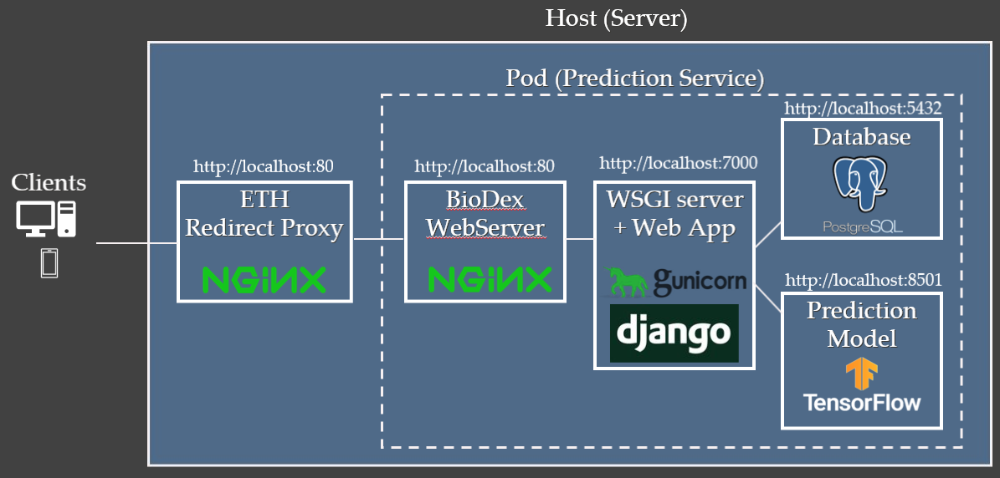

# BioDex - Prediction API & Website
[-> back to main README](../README.md)  

The _Prediction API_ is built with Django REST Framework. 
It is used to 
- store image and taxonomic data for model training 
- act as a gateway to the prediction model (by preprocessing posted images and postprocessing model response results)
- gather response metadata (e.g. example images)
- store data from prediction requests to be used for future analysis

## Contents
- [Architecture](#architecture)
- [Endpoints](#endpoints)
- [Testing](#testing)
- [Admin](#admin)
- [Users](#users)
- [Models](#Models)
    - [Taxonomy](#Taxonomy)
    - [Images](#Images)
    - [Image Classifications](#Image-Classifications)
    - [Prediction Models](#Prediction-Models)
    - [Predictions](#Predictions)
- [Database Fixtures](#Data-Fixtures)
- [Prediction Model / Tensorflow Serving](#Tensorflow-Serving)
    - [containerize a model](#containerize-a-model)
- [Running the project locally](#run-the-project-locally)
    - [Emails & Environment variables](#environment-variables-in-development-mode)
- [Deployment](#Deployment)

# Architecture

# Endpoints

Detailed documentation about the API endpoints can be found at https://biodex.ethz.ch/pred-api/docs/

# Testing

## Testing with Django & Coverage

_TO FOLLOW_

## Testing with Postman
~~For convenience, you can import the Lepi.postman_collection.json into postman and test the endpoints there. https://www.postman.com/
The collection can be found in /backend~~

# Admin

With a staff or superuser account, you are able to login to https://biodex.ethz.ch/pred-api/lepi-admin/ to
manage users, api tokens and other database records

The site .../admin/ is the default location for the admin site in Django. For security measures, we have renamed it as 
mentioned above.

# Users

Prediction API and website users can only be created via the django admin panel as there is no sign up process. This is to control who is using the prediction api in their programs.

There is currently no way to register without knowing an admin.

## Predictions

things that are needed by the model for predictions

__image normalization values__

before the image is sent to the tensorflow model for prediction, the rgb values in the image are normalized, using the mean values for rgb mean and rgb standard deviation which was calculated for that model's training data. 

__species_key_map__
maps the species as numbered by the prediction model, to the species PKs in the database
model classes will range from 0 to n, where _n_ is the number species the model was trained on. Class 0 in one model may not be the same as class 0 in a different model.The individual model ids need to be mapped to permanent species id numbers in the db

__encoded hierarchy maps__

this maps how classes in each hierarchical level map to the classes in their parent level. This is used when summing up the probabilies from the species level up to the family level.

Detailed Steps: API Prediction Post Request:

1. Api receives a Post request with a image data in field ‘image’
1. Image is saved to `mediafiles` folder
1. Image file is opened (with Pillow)
1. Check the identifier (version number) for the active tensorflow model
1. Load the preprocessing parameters (mean and standard deviation for the RGB values of the dataset used to train the active model)
1. Preprocess the image (i.e. normalize image using appropriate mean and std dev values & convert image obj to a list)
1. Post the image to the active model’s endpoint in the Tensorflow Model Container
1. Logits (raw results) from model are converted to probabilities using softmax
1. keys for the specific model are mapped to the species id’s in the database
1. Probabilities are summed for each level in the taxonomic hierarchy 
1. Results are sorted from highest taxonomic level (family) to lowest (species)
1. Top 10 results are selected
1. String names for top results are queried
1. Example images for top results are queried  
1. Json Response is formed and returned

# Prediction Model

 
## Embed model in a Docker Image 
__(reference https://www.tensorflow.org/tfx/serving/docker)__  

make sure that the model that you want to containerize is saved in the models folder in the model_serving directory. The model should be in the tf.saved_model format, with a numerical folder name (e.g. a datetimestamp 202004281030)

Go to model_serving folder and run:

    bash make_docker_image.sh

this convenience script pulls the tensorflow serving base image, adds the selected model from the local models folder, and creates a new image tagged with latest & the model number (see Dockerfile for more details

## run the container
docker run -p 8501:8501 [DOCKER_IMAGE_NAME]

#this exposes an endpoint that can be used for predictions

SERVER_URL = 'http://localhost:8501/v1/models/[DOCKER_IMAGE_NAME]:predict'

## Emails

~~Emails are automatically sent when a user is invited or a reset password code has been requested. This is handled in the 
background / asynchronously with redis and celery.~~

### Email Models

- Email: Is the effective html code being sent by email. We use Django templates with html, to be able to style the content as we want.
- EmailType: Defines the dynamic content based on what email type it is and the html extension. For example registration or password reset.
- DevEmail: Email addresses need to be registered as dev emails if you want to receive emails in development mode.

## Models

## Run the project locally

- You will need to have Docker installed on your machine. https://docs.docker.com/get-docker/

- After having cloned the repo, through the terminal, navigate inside the folder where the Dockerfile is located
- Run `docker build -t lepi .` to create the Docker image on your machine. You can replace 'lepi' with any name you want
- Replace the image name of the backend container in 'docker-compose.yml', with the name you used to build the image in previous step

- Run `docker-compose up -d` in your terminal, to start up all containers. This will also pull the needed Docker images such as Postgres, Redis etc. if you don't already have them on your machine.
- Run `docker exec -ti lepi_backend_1 bash` in your terminal. This is to log into the container, which is running the REST API. Make sure 'lepi_backend_1' is the name of the running container. Else replace it with the correct name or with the container ID.
- Run `python manage.py runserver 0:8000` and visit http://0.0.0.0:8000/ - you should get a 404 served by Django, means it is running! We just do not serve anything on `/`.
- Run `python manage.py migrate` to create the tables in your database (this needs only to be done the first time or if you update the models)
- Run `python manage.py createsuperuser` to create a superuser. Visit http://0.0.0.0:8000/backend/lepi-admin and use the credentials to log in

### Environment variables in development mode

- To have emails being sent automatically for registration and password resetting, you will have to add a gmail address and password in /envs/dev.env
- For emails to be sent out during development mode, you will also have to add your email through Django admin under DevEmails

- If you would like to add Sentry, which can help monitoring and debugging, you will also have to add your Sentry DSN

# Deployment

The containers are run using podman which, as opposed to Docker, allows containers to be run by a nonroot process.

copy contents of podman/prod folder to the host server. save files in the project, or users' home, folder.
Assuming in the you are in ./podman folder

    scp -r ./prod

1. transfer image, fixturefile &  staticfile tar files to server
1. transfer env variable files
1. run docker-compose -f docker-compose.prod.yml -p biodex up --build
1. run migrations to tables: migrate docker-compose -f docker-compose.prod.yml exec web python manage.py migrate
1. create superuser for django
1. load fixture files using bash script: docker-compose exec web sh load_fixtures.sh 